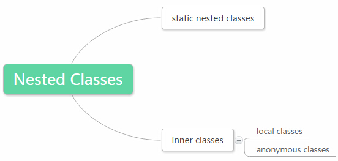

# Inner Class和Nested Class

[TOC]

## Nested Classes可以是静态的或非静态的

嵌套类（Nested Classes）可以进一步分为两种类型：非静态（Non-static）嵌套类和静态（static）嵌套类。非静态嵌套类通常被称作内部类（Inner Classes）



## 内部类的例子（也叫作非静态嵌套类）

```java
class OuterClass  {
/*  some code here...*/

	class InnerClass  {  }

/*  some code here...*/
}
```

## 内部类是嵌套类的子集

记住内部类是一种特殊的嵌套类，即非静态嵌套类。换句话说内部类是嵌套类的子集，所以“内部类”和“嵌套类”是不可以互换的。可以说“内部类是嵌套类”，而不能说“嵌套类是内部类”。

## 内部类为什么如此特别？

主要是因为**内部类的实例可以访问所有外部类的成员**，即使是私有的。

## 内部类对比静态内部类

*static inner classes*这种说法是错误的，应该用*static nested classes*代替。

## 为什么必须称静态嵌套类而不是静态内部类

因为没有*static inner classes*这种东西，“**inner** class”这个术语意味着它可以访问外部类实例变量。

## 内部类是外部类“inner circle"的一部分

一个内部类实例可以访问所有外部类成员，但是静态嵌套类不能。

## 内部类可以访问外部类非静态成员

内部类不能是静态的原因是**静态环境下不能访问非静态的变量和方法**（static是限制生命期，静态环境生命期一直存在，访问非静态的变量可能会不存在），所以**静态嵌套类只能访问外部类的静态成员**。并且，通过定义可以知道内部类可以访问外部类非静态成员，所以不能叫”static inner classes"，要叫“static nested classes"

## 静态嵌套类的例子

```java
class Outer {
    static class NestedStatic { }
}
```

可以将上例中NestedStatic类看作外部类的静态成员，所以要访问它不需要外部类的实例。

## 怎样实例化静态嵌套类

实例化静态嵌套类的语法取决于这个静态嵌套类是当前类的成员还是其他类的成员。

## 实例化非封闭类的静态嵌套类

把嵌套了静态类的类叫封闭类，我们要在没有嵌套静态类的非封闭类中实例化静态嵌套类，代码如下：

```java
/**
嵌套了静态嵌套类的封闭类
*/
class EnclosingClass {
  	static class Nested {
  		void someMethod() { System.out.println("hello"); }
  	}
}

class NonEnclosingClass {
	public static void main(String[] args) {
        //实例化的嵌套类是封闭类的静态成员
        EnclosingClass.Nested n = new EnclosingClass.Nested(); 
        n.someMethod();  //prints out "hello"
	}
}
```

注意：`EnclosingClass.Nested n = new EnclosingClass.Nested(); `

## 实例化封闭类的静态嵌套类

在封闭类中静态嵌套类已经是当前类的一部分，注意对比正常的语法
`Nested n = new Nested();` 和
`EnclosingClass.Nested n = new EnclosingClass.Nested();` 
代码如下：

```java
class EnclosingClass {
	static class Nested {
		void anotherMethod() { System.out.println("hi again"); } 
	}

	public static void main(String[] args) {
        //access enclosed class:
        Nested n = new Nested(); 
        n.anotherMethod();  //prints out "hi again"
	}
}
```

## 静态嵌套类访问非静态实例变量

在NestedStatic类内部，如果试图访问外部类的非静态变量：

```java
class Outer {
    int instanceVar = 5;
    
    static class NestedStatic {
        public static void main(String[] args){

            /*instanceVar is a non-static variable
            belonging to the Outer class:  */
			//错误的
            instanceVar = 10; 

        }
    }
}
```

上面的代码会抛出一个编译器错误`"non-static variable instanceVar cannot be referenced from a static context”`，这个错误很合理，因为`instanceVar`是非静态的变量，而NestedStatic类是静态的。并且，由于我们不需要外部类的对象就能访问静态NestedStatic类，这使得不能访问非静态的实例变量变得合理（需要外部类的对象才能访问非静态变量）。

## 总结

更多内部类文章参考[When to use inner classes in Java](http://www.programmerinterview.com/index.php/java-questions/when-to-use-inner-classes-in-java/)

## 参考

- [Inner vs nested class](http://www.programmerinterview.com/index.php/java-questions/inner-vs-nested-classes/)
- [Java内部类详解](http://www.cnblogs.com/dolphin0520/p/3811445.html)
- [Java嵌套类](http://blog.csdn.net/u200814499/article/details/44408649)